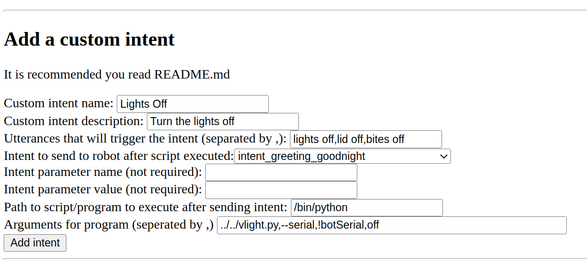

Things that are good to know.

# Running wire-pod in the background

- NOTE: Does not work in Windows under WSL

You can setup a systemd daemon for wire-pod. This allows it to run in the background and it to run automatically at startup.
```
cd ~/wire-pod
sudo ./setup.sh daemon-enable
```
To start the service, either restart your computer or run:

`sudo systemctl start wire-pod`

To see logs, run:

`journalctl -fe | grep start.sh`

If you would like to disable the daemon, run:
```
cd ~/wire-pod
sudo ./setup.sh daemon-disable
```


***


# Updating wire-pod

To update to a newer version of wire-pod, make sure chipper is not running then run the following commands:

```
cd ~/wire-pod
sudo git pull
cd chipper
sudo ./start.sh
```

If you have set wire-pod up as a daemon, run `sudo systemctl start wire-pod` rather than `sudo ./start.sh`.


***


# Web interface

Chipper hosts a web interface at port 8080 (by default). This can be used to create custom intents and to configure specific bots.

To get to it, open a browser and go to `http://serverip:8080`, replacing serverip with the IP address of the machine running the chipper server. If you are running the browser on the machine running chipper, you can go to `http://localhost:8080`

- SDK app
	- This is a page that allows you to configure any bot that has been logged in to your wire-pod instance.
	- You can configure any setting the app can and more.
	- There is a control page which allows you to assume behavior control of the robot and use your keyboard to control. You can also get a camera stream and make the robot say stuff.
- Custom intents
	- Example: You want to create a custom intent that allows Vector to turn the lights off. The transcribed text that matches to this intent should include "lights off" and other variations like "lid off" for better detection. It will execute a python script located in your user directory called `vlight.py`. It should be launched with the `off` variable because the lights are being turned off. This script turns the lights off and connects to Vector so he says "The lights are off!". You have multiple bots registered with the SDK so a serial number must be specified. After the SDK program is complete, chipper should send `intent_greeting_goodnight`. The following screenshot is a correct configuration for this case. The `Add intent` button would be pressed after everything is put in.
	- 
	- (If `!botSerial` is put into the program arguments, chipper will substitute it for the serial number of the bot that is making a request to it.)
- Bot configurations
	- NOTE: This is deprecated and `sdkapp` should be used to configure bots rather than this. This is still here for OSKR/dev bots running older software.
	- Example: You have a bot on 1.6 with a serial number of 0060059b; located in Des Moines, Iowa; and you would like to use Fahrenheit for the temperature unit in the weather command. The following screenshot is a correct configuration for that bot. Once that is input, you would press "Add bot". It would then be registered with chipper.
	- 